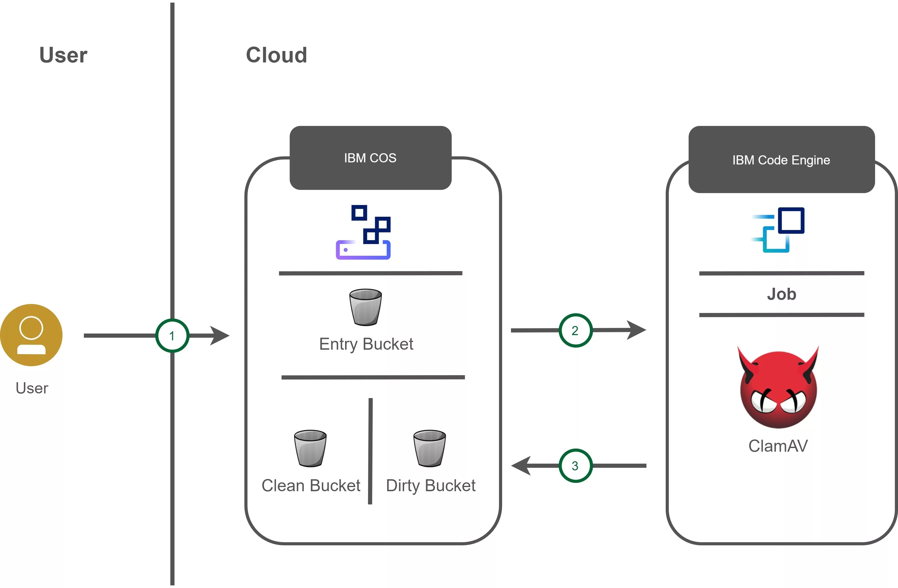

# How to provide Virus-Scanning as a Service utilizing the serverless IBM Code Engine

This project was initiated by Janik Buecher(https://github.com/JanikBuecher/code-engine-virus-scan).

I am only updating it utilizing new features of IBM Cloud Code Engine and updating the images to make it more secure.

Welcome to this tutorial on how to scan files for computer viruses in the IBM Cloud Object Storage (COS) with IBM Code Engine.

## Architecture



First the user uploads a file to a specific bucket in his IBM COS instance. An application, running in IBM Code Engine is listening to this bucket and will trigger the av-job job when a file is uploaded.
The av-job is also running in IBM Code Engine and will pull the file and scan it for viruses. Then it will delete the file from the original bucket and will move it either to the clean or dirty bucket, where the infected files are quarantined.

## Prerequisites

This tutorial requires to:

1. Install the IBM Cloud CLI:
   - Mac: `curl -fsSL https://clis.cloud.ibm.com/install/osx | sh`
   - Linux: `curl -fsSL https://clis.cloud.ibm.com/install/linux | sh`
   - Windows (Powershell): `iex(New-Object Net.WebClient).DownloadString('https://clis.cloud.ibm.com/install/powershell')`
2. Install the IBM Cloud Code Engine CLI Plugin: `ibmcloud plugin install code-engine`
3. Install the IBM Cloud COS CLI Plugin: `ibmcloud plugin install cloud-object-storage`
4. Install the IBM Cloud Container Registry Plugin: `ibmcloud plugin install cr` (If using IBM Cloud Registry)

## Setup

### Step 1: Create buckets in the IBM COS

1. Create an instance of [IBM Cloud Object Storage](https://cloud.ibm.com/catalog/services/cloud-object-storage):
   1. Select the **Lite** plan or the **Standard** plan if you already have an Object Storage service instance in your account.
   2. Set **Service name** to `code-engine-cos` and select a resource group
   3. Click on **Create**
2. Create service credentials

   1. Give it a name `cos-for-code-engine` and select Writer as the role
   2. Click **Add**

3. Under Buckets, create three custom buckets. _When you create buckets or add objects, be sure to avoid the use of Personally Identifiable Information (PII).Note: PII is information that can identify any user (natural person) by name, location, or any other means._

   - An entry bucket (Files get uploaded here)
   - A clean bucket (Clean Files get moved here)
   - A dirty bucket (Infected Files get moved here)

   1. Give the buckets a unique name like `<some_name-cos-bucket-ce>`
   2. Select **Regional** resiliency.
   3. Select a location.
   4. Select a **Standard** or **Smart-Tier** storage class for high performance and low latency.
   5. Click **Create** bucket

   In the end you should have three different buckets within the same region.

4. On the left pane under **Endpoints**, Select **Regional** resiliency and select a location.
5. Copy the desired **Direct** endpoint to access your buckets and save the endpoint for quick reference, this is due to Code Engine having access to the bucket network internally, reducing costs.

### Step 2: Create an IBM Code Engine Project

1. In a terminal on your machine, ensure you're logged in to the `ibmcloud` CLI.
   ```console
       $ ibmcloud login
   ```
2. You will also need to target the resource group and region where you created your project.
   ```console
       $ ibmcloud target -g <YOUR_RESOURCE_GROUP_NAME> -r <YOUR_REGION>
   ```
3. Create a new project IBM Code Engine project
   ```console
       $ ibmcloud ce project create --name <YOUR_PROJECT_NAME>
   ```
4. Make the command line tooling point to your project
   ```console
       $ ibmcloud code-engine project select --name <YOUR_PROJECT_NAME>
   ```

### Step 3: Create the Virus Scan job

1. Go to the av-job folder
   ```console
       $ cd ./docker/av-job
   ```
2. Build the image
   ```console
       $ docker build . -t <YOUR_REGISTRY>/<YOUR_IMAGE_NAME>
   ```
3. Push your image to your registry. _Note: You don't habe to use a docker registry_
   ```console
       $ docker push <YOUR_REGISTRY>/<YOUR_IMAGE_NAME>
   ```
4. Create the av-job in IBM Code Engine with at least 2GB of RAM, because the anti-virus software needs that much, ClamAV recommends 4GB, for storage the instance has a limitation of memory size to use.
   ```console
      $ ibmcloud ce job create -n av-scan -i <YOUR_REGISTRY>/<YOUR_IMAGE_NAME> --memory 4G --ephemeral-storage 4G
   ```

### Step 4: Connect the virus-scan job with your IBM COS instance

1. You will also need to provide the job with your bucket names where you want to move the files, as well as your COS endpoint. Define a configmap to hold the bucket name and the endpoint as the information isn't sensitive. ConfigMaps are a Kubernetes object, which allows you to decouple configuration artifacts from image content to keep containerized applications portable. You could create this configmap from a file or from a key value pair -- for now we'll use a key value pair with the `--from-literal` flag.
   ```console
      $ ibmcloud code-engine configmap create --name virus-scan-configuration --from-literal=COS_BUCKET_DIRTY=<COS_BUCKET_NAME> --from-literal=COS_BUCKET_CLEAN=<COS_BUCKET_NAME> --from-literal=COS_BUCKET_ENTRY=<COS_BUCKET_NAME> --from-literal=COS_ENDPOINT=<COS_ENDPOINT>
   ```
2. With the configmap defined (You can also change this via UI), you can now update the job by asking Code Engine to set environment variables in the runtime of the job based on the values in the configmap. Update the job with the following command:
   ```console
     $ ibmcloud code-engine job update --name av-scan --env-from-configmap virus-scan-configuration
   ```
3. Create a binding for Object Storage service with a prefix **COS_SECRET** for ease of use in your application. Creating this binding will give your Code Engine application access to the service credentials for IBM Cloud Object Storage so that it can store files in COS. _Note: Each service binding can be configured to use a custom environment variable prefix by using the --prefix flag._
   ```console
      $ ibmcloud code-engine job bind --name av-scan --service-instance code-engine-cos --prefix COS_SECRET
   ```
### Step 5: Create the CE Event Subscription for COS Uploads

1. Create a Code Engine Event Subscription from the entry COS bucket. This allows Code Engine to know when a file is uploaded to object storage and run the scan job. For our uses this will use default prefix (CE prefix) and will also send the file name to Code Engine.
   ```console
      $ ibmcloud ce subscription cos create --name code-engine-cos --destination av-scan --destination-type job --bucket <ENTRY_BUCKET_NAME>
   ```

### Step 6: Try it out

When you upload a file into your entry bucket, it will be scanned for viruses and then moved to either the clean or dirty bucket.
